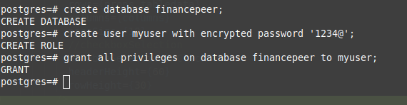
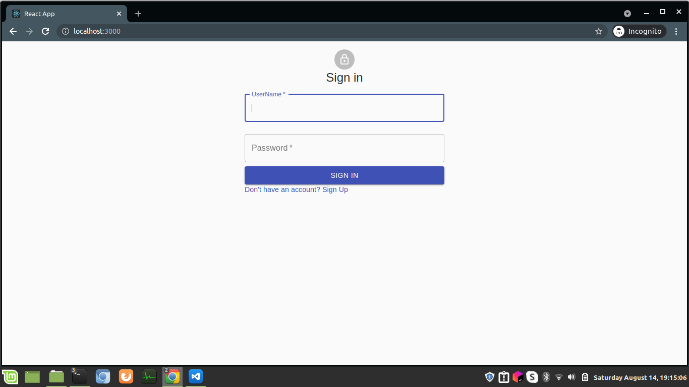
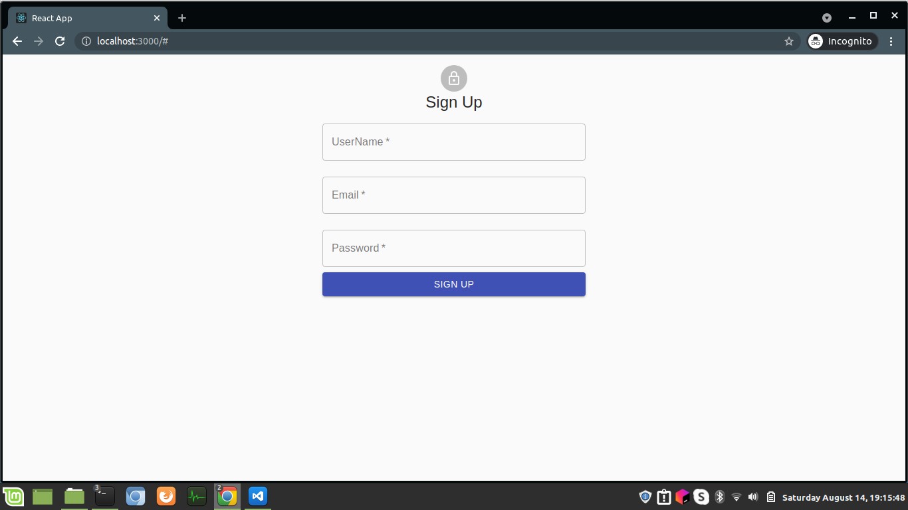
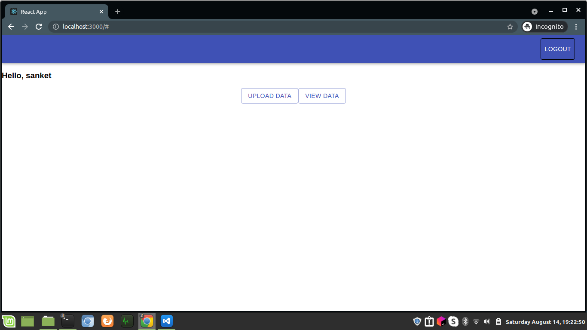
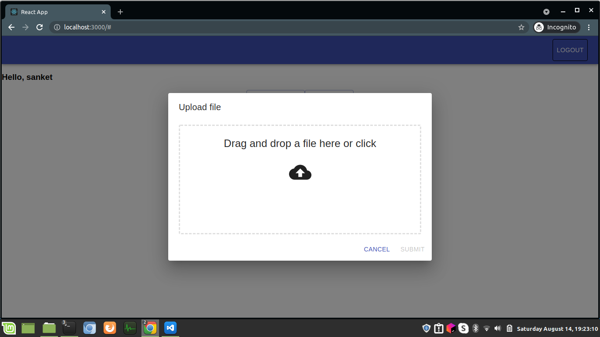
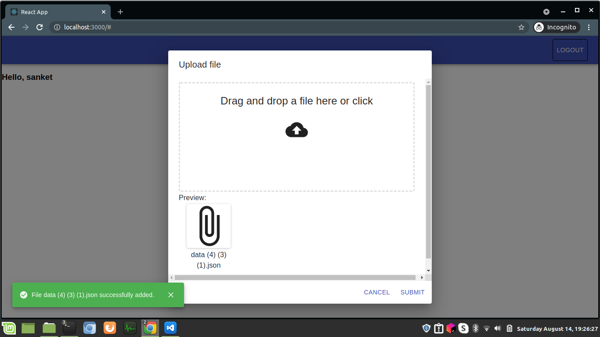
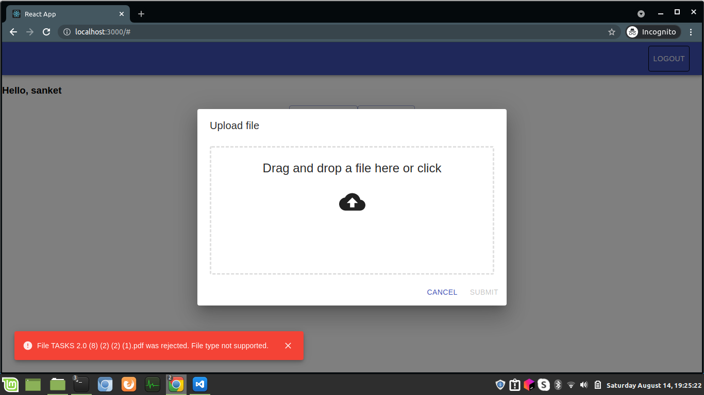
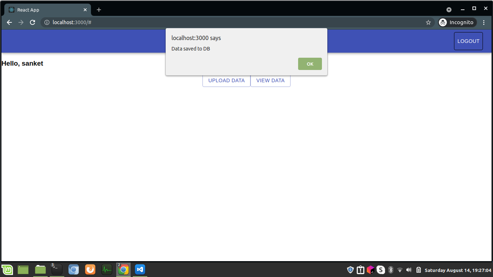
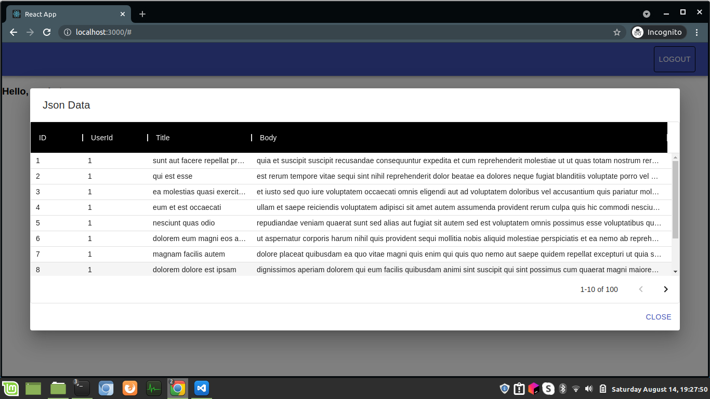

# JsonViewer

Web application built using Django, React &amp; Postgres to login and upload &amp; display JSON

## Getting Started

### Setting Frontend

Navigate to frontend directory and run

1. Install dependencies `npm install`
2. Start frontend Server `npm start`. This will start frontend on the address [localhost:3000](http://localhost:3000)

### Setting Backend

Navigate to backend directory and run

1. Install dependencies `pip install -r requirements.txt`
2. Setting Postgres
   

3. Django migrations `python manage.py makemigrations` and `python manage.py migrate`
4. Start backend Server `python manage.py runserver`

## Application Screenshots

Login Page.

SignUp Page. User can sign up using this page

Once the user login, the following page loads

User clicks on `Upload Data` button, a popup comes up for uploading the file

Alert message: When file is uploaded

Alert message: When filetype is not Supported

Alert message: When corrupt JSON is uploaded

Alert message: When Data is saved successfully to DB when user clicks on Sumbit button

User can view the data by clicking on `View Data` button. Users can also filter and sort table rows.

